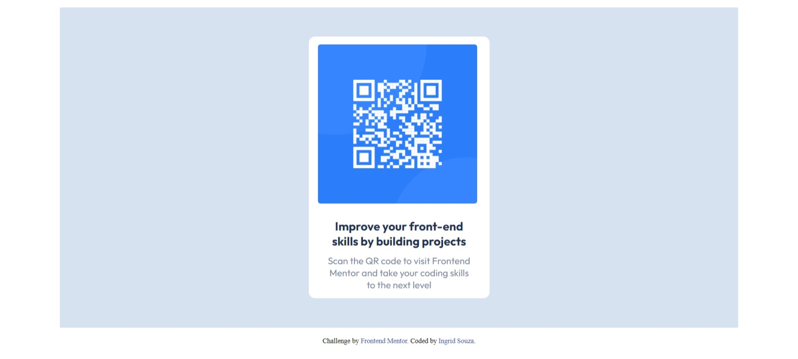

# Frontend Mentor - QR code component solution

This is a solution to the [QR code component challenge on Frontend Mentor](https://www.frontendmentor.io/challenges/qr-code-component-iux_sIO_H). Frontend Mentor challenges help you improve your coding skills by building realistic projects. 

## Table of contents

- [Screenshot](#screenshot)
- [Links](#links)
- [Built with](#built-with)
- [Author](#author)

### Screenshot

This is the example full screen:

This is the example responsive:

### Links

- Solution URL: [Solution here](https://your-solution-url.com)

### Built with

- HTML
- CSS
- Flexbox
- Mobile-first workflow

## Author

- Website - [Ingrid Souza](https://ingridssilveira.github.io/IngridSouza)
- Frontend Mentor - [@IngridsSilveira](https://www.frontendmentor.io/profile/IngridsSilveira)
- GitHub - [@IngridsSilveira](https://github.com/IngridsSilveira)